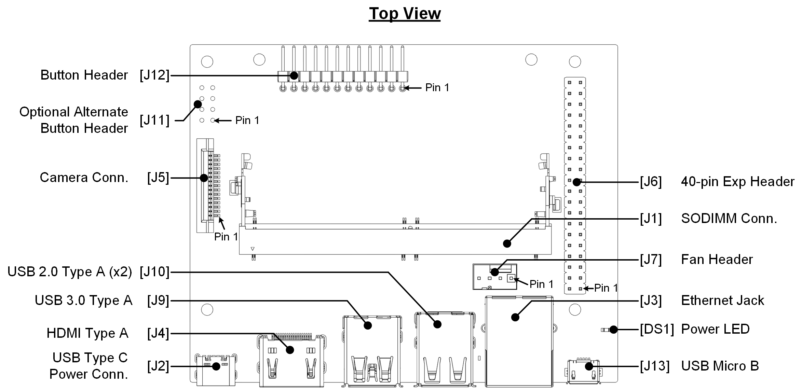
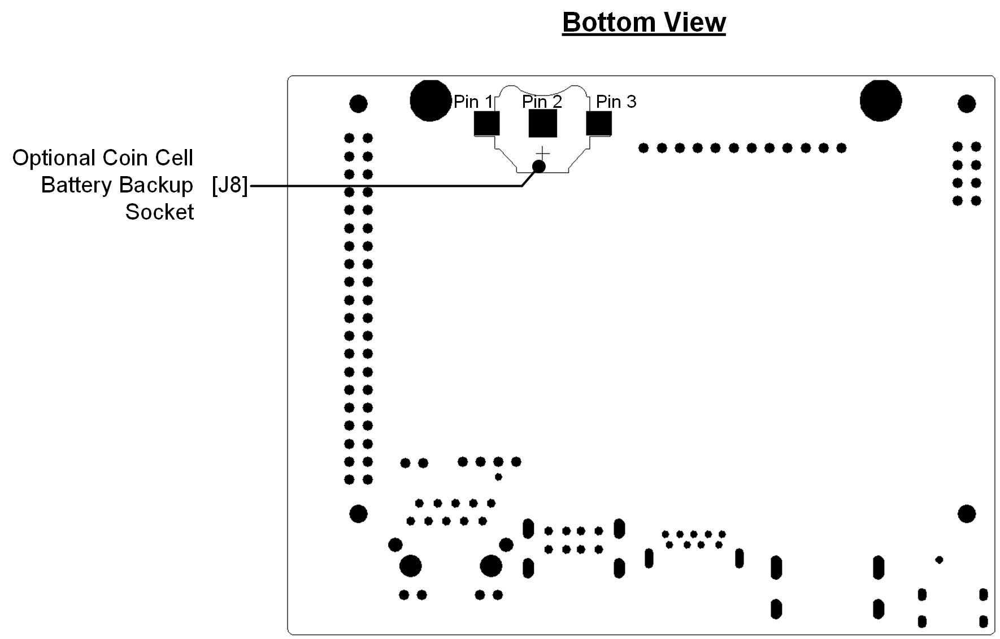
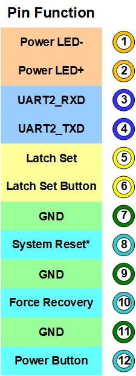
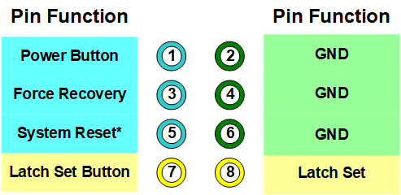
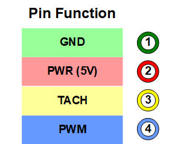

# User Guide

> 本地备份了一份 [Jetson Nano 2GB Developer Kit User Guide](https://developer.nvidia.com/embedded/learn/jetson-nano-2gb-devkit-user-guide) 的管脚定义部分

## Carrier Board Layout

[DS1] Power LED; lights when the developer kit is powered on

[J1] SO-DIMM connector for Jetson module. Module is pre-assembled on the developer kit

[J2] USB Type C power connector for 5V⎓3A power supply

[J3] RJ45 ethernet connector

[J4] HDMI connector

[J5] Camera connector for MIPI-CSI2 camera

[J6] [40-pin header ](#40-Pin Header (J6)): Includes power pins ( +5V/+3.3V) and interface signal pins for I2C (2x), UART, SPI (2x), I2S, and GPIOs

[J7] [4-pin fan control header ](#4-Pin Fan Header (J7)). Pulse Width Modulation (PWM) output and tachometer input are supported

[J8] Optional coin-cell socket

[J9] USB 3.0 type A connector. Limited to 1A total power delivery

[J10] Stack of two USB 2.0 type A connectors supporting Host Mode only

[J11] [Optional button header ](#8-Pin Button Header (J11))(2x4); Includes connections for Reset/Force Recovery/Power Buttons, and Auto-power-on disable

[J12] [Button header ](#12-Pin Button Header (J12))(1x12); Includes connections for power LED, Reset/Force Recovery/Power Buttons, UART, and Auto-power-on disable

[J13] Micro-USB 2.0 connector supporting Recovery Mode and Device Mode

## 40-Pin Header (J6)

The 40-pin header provides access to power, ground, and interface signal pins.

- Power pins
  - There are two 3.3V power pins and two 5V power pins. These are not switchable; power is always available when the developer kit is connected to power.
  - The two 5V pins can be used to power the developer kit at 2.5A each. (Do not power the developer kit via these pins and USB-C connector at the same time.)
- Interface signal pins
  - All signals use 3.3V levels
  - By default, all interface signal pins are configured as GPIOs, except those supporting I2C and UART

[Jetson.GPIO ](https://github.com/NVIDIA/jetson-gpio)offers an easy way to control GPIO pins. [Jetson-IO ](https://docs.nvidia.com/jetson/l4t/index.html#page/Tegra Linux Driver Package Development Guide/hw_setup_jetson_io.html)can be used to reconfigure pin functions, e.g., from GPIO to SFIO (Special Function I/O) such as I2C, I2S, etc . Both Jetson.GPIO and Jetson-IO are already included in JetPack.

Note that the I2C interface pins are pulled up with 2.2kohm resistors to 3.3V. All signals except the I2C interfaces connect to the SoC through Texas Instruments TXB0108RGYR level shifters. See " *[Jetson Nano Developer Kit 40-Pin Expansion Header GPIO Usage Considerations ](https://developer.nvidia.com/embedded/downloads#?search=Jetson Nano Developer Kit 40-Pin Expansion Header GPIO Usage Considerations)*" for more information on these level shifters and how to work with signals that connect to them.

## 12-Pin Button Header (J12)

This header provides GPIO to control the state of the board. Enclosures for the developer kit can connect to this header.

| Pin  |         Name         |                         Description                          | Power |
| :--: | :------------------: | :----------------------------------------------------------: | :---: |
|  1   |     Power LED -      | Connects to LED Cathode to indicate System Sleep/Wake (Off when system in sleep mode) |  +5V  |
|  2   |     Power LED +      |              Connects to LED Anode (see pin 1)               |  +5V  |
|  3   |      UART2_RXD       |                           Receive                            | +3.3V |
|  4   |      UART2_TXD       |                           Transmit                           | +3.3V |
|  5   |      Latch Set       | Connect pin 5 and pin 6 to disable Auto-Power-On and require power button press (or equivalent) |  +5V  |
|  6   |   Latch Set Button   | Connect pin 5 and pin 6 to disable Auto-Power-On and require power button press (or equivalent) |  +5V  |
|  7   |        Ground        |                                                              |       |
|  8   |     Reset Button     | Connect normally open button to pin 7 and pin 8. Temporarily press button to initiate system reset | +1.8V |
|  9   |        Ground        |                                                              |       |
|  10  | Recovery Mode Button | Connect normally open button to pin 9 and pin 10. Hold button down while powering on the system to put it in USB Force Recovery mode | +1.8V |
|  11  |        Ground        |                                                              |       |
|  12  |     Power Button     | Connect normally open button to pin 11 and pin 12. Temporarily press button to initiate power-on if Auto-Power-On disabled (pin 5 and pin 6 connected) |  +5V  |

## 8-Pin Button Header (J11)

This is an alternate 8-Pin (2x4) button header that can be soldered on the carrier board in location J11 and used in alternative of the main button header.

Header details ( [examples ](https://www.digikey.com/products/en/connectors-interconnects/rectangular-connectors-headers-male-pins/314?k=header&k=&pkeyword=header&sv=0&pv69=411897&pv2018=9726&sf=1&FV=90|121326%2C-8|314%2C88|281410&quantity=&ColumnSort=0&page=1&pageSize=25)):

- Total pins/positions 8
- 2 rows of 4 pins
- Pitch is 2.54mm
- Unshrouded
- Through hole vertical

| Pin  |         Name          |                         Description                          | Power |
| :--: | :-------------------: | :----------------------------------------------------------: | :---: |
|  1   |     Power Button      | Connect normally open button to pin 1 and pin 2. Temporarily press button to initiate power-on if Auto-Power-On disabled (pin 7 and pin 8 connected) |  +5V  |
|  2   |        Ground         |                                                              |       |
|  3   | Force Recovery Button | Connect normally open button to pin 3 and pin 4. Hold button down while powering on the system to put it in USB Force Recovery mode | +1.8V |
|  4   |        Ground         |                                                              |       |
|  5   |     Reset Button      | Connect normally open button to pin 5 and pin 6. Temporarily press button to initiate system reset | +1.8V |
|  6   |        Ground         |                                                              |       |
|  7   |   Latch Set Button    | Connect pin 7 and pin 8 to disable Auto-Power-On and require power button press (or equivalent) |  +5V  |
|  8   |       Latch Set       | Connect pin 7 and pin 8 to disable Auto-Power-On and require power button press (or equivalent) |  +5V  |

## 4-Pin Fan Header (J7)

The pinout of the 4-pin fan control header at location J7 is shown below.

Initial units of the Jetson Nano 2GB Developer Kit without wireless networking adapter (PN: 945-13541-0001-000) do not have a fan header already stuffed at J7. See **[fan header installation ](https://developer.nvidia.com/embedded/learn/jetson-nano-2gb-devkit-user-guide#id-.JetsonNano2GBDeveloperKitUserGuidevbatuu_v1.0-fan_header_installation)**below if you have a developer kit without fan header and you want to install one.

The header can support either a 3-pin fan connection (GND, PWR, and TACH) or a 4-pin fan connection (GND, PWR, TACH, and PWM). Using a fan with PWM capability allows software to adjust the speed of the fan as needed. Only 5V fans are supported.

| Pin  | Description                  |
| :--- | :--------------------------- |
| 1    | Ground                       |
| 2    | +5V Power                    |
| 3    | Tachometer                   |
| 4    | PWM (Pulse Width Modulation) |